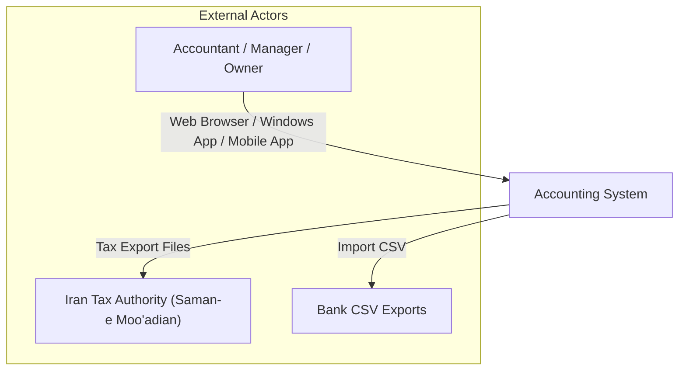
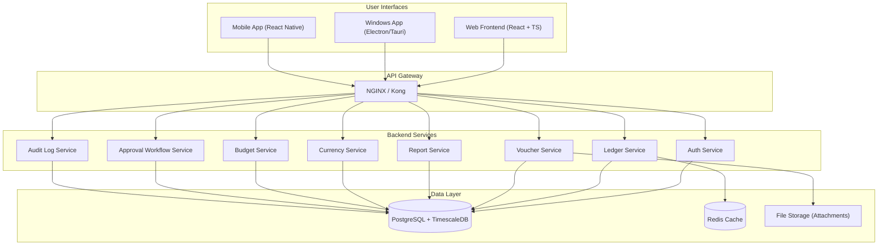
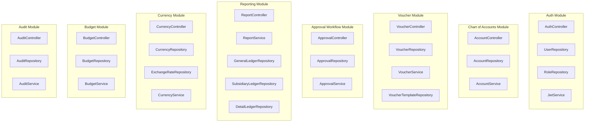
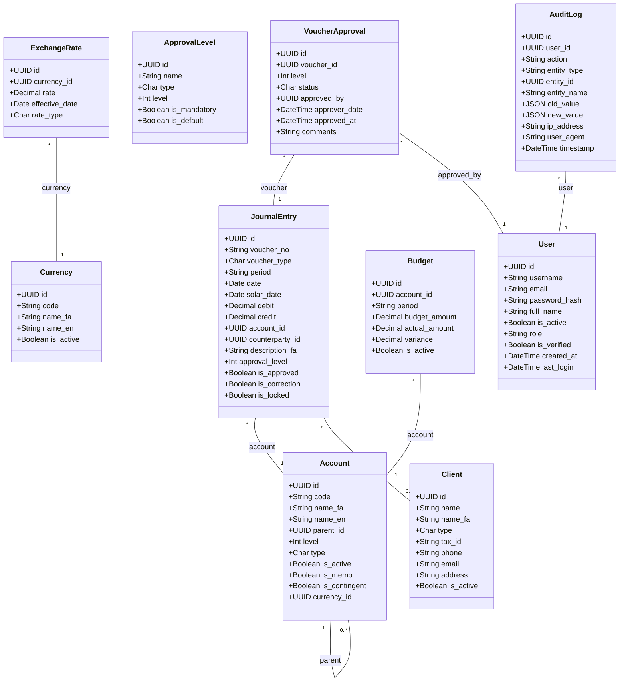
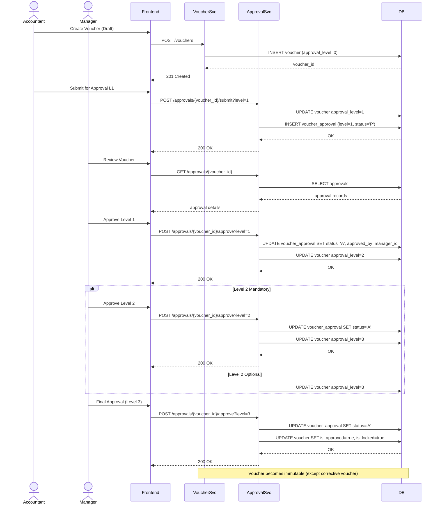
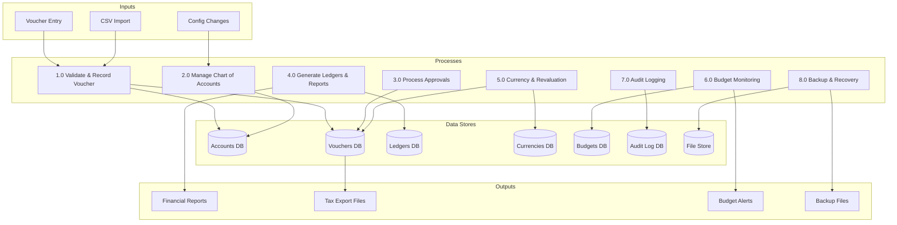

# Pre-Code Diagrams (Six Levels)

This document contains the six-level diagrammatic specification for the Accounting System, covering UML, BPMN, DFD, and ERD perspectives.

---

## Level 1 – System Context Diagram (C4 Context)



---

## Level 2 – Container Diagram (C4 Container)



---

## Level 3 – Component Diagram (C4 Component) – Backend Core



---

## Level 4 – Domain Class Diagram (UML)



---

## Level 5 – Sequence Diagram: Voucher Approval Workflow



---

## Level 6 – Data Flow Diagram (DFD) – Level 0 & Level 1

### Level 0 – Context DFD

```mermaid
graph LR
    User[("User")] -->|Voucher Data, Queries| System[["Accounting System"]]
    System -->|Reports, Ledgers| User
    Tax[("Tax Authority")] <--|Export Files| System
    Bank[("Bank")] -->|CSV Import| System
    Audit[("Audit Log Store")] <--|Audit Events| System
```

### Level 1 – Major Processes



---

*All diagrams are expressed in Mermaid syntax for version-controlled, renderable documentation.*